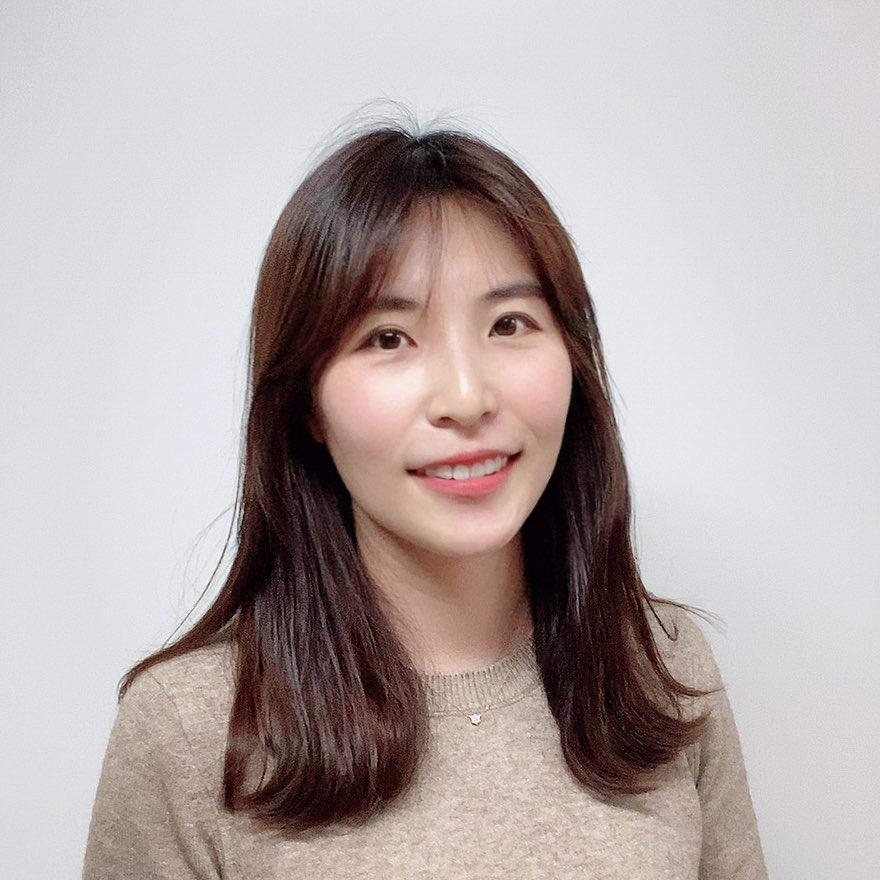

Jeongeun Lee
======

I love to see how information technology can help solve scientific problems efficiently. 

Education
======
current Ph.D candidate in Bioengineering, Seoul National University, South Korea
        Dissertation: A Study on Genetic Implications of Korean Individuals through the Establishment of Genome Dataset (working title)
        Advisor: Jinwook Choi, M.D. Ph.D. & Murim Choi, Ph.D.

2014    M.S. in Bioengineering, Seoul National University, South Korea
        Dissertation: Extracting biomarker information from pathology reports using natural language processing
        Advisor: Jinwook Choi, M.D. Ph.D.

2012    B.S. in Media Communications Engineering (Electrical Engineering) with an honor of summa cum laude

Skills
======
Computing languages: Python, Java, R, Perl, Bash, HTML
Bioinformatics: Hail, pipeline management for NGS data analysis
Cloud computing: amazon, google cloud
Laboratory skills: Sanger sequencing from saliva
